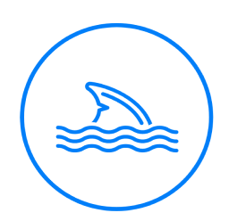
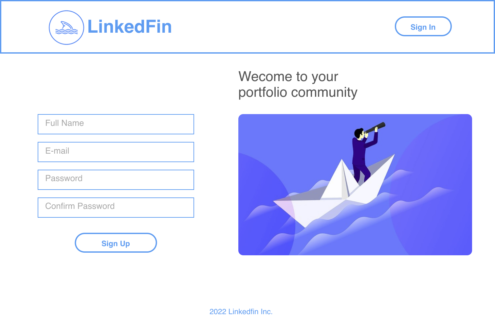
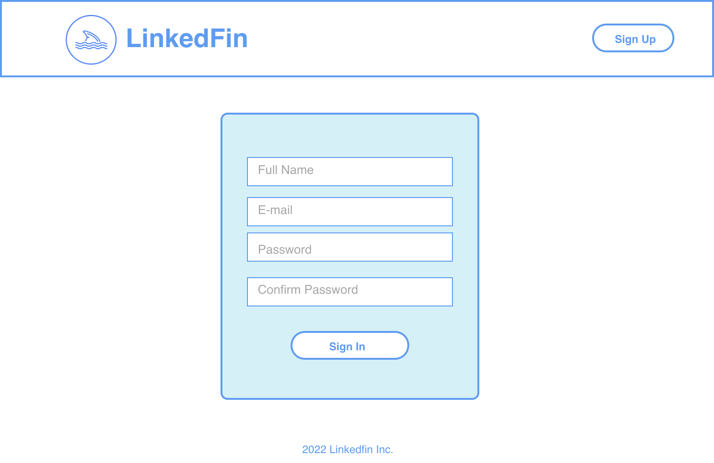
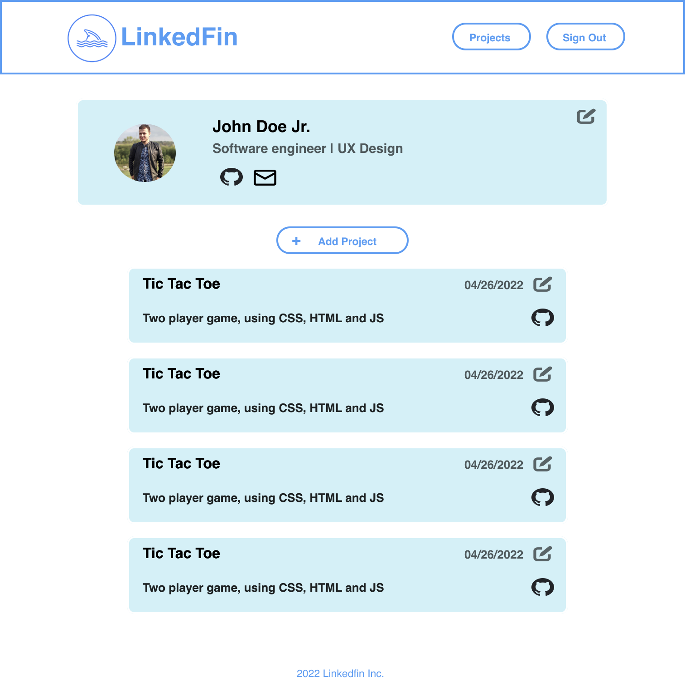
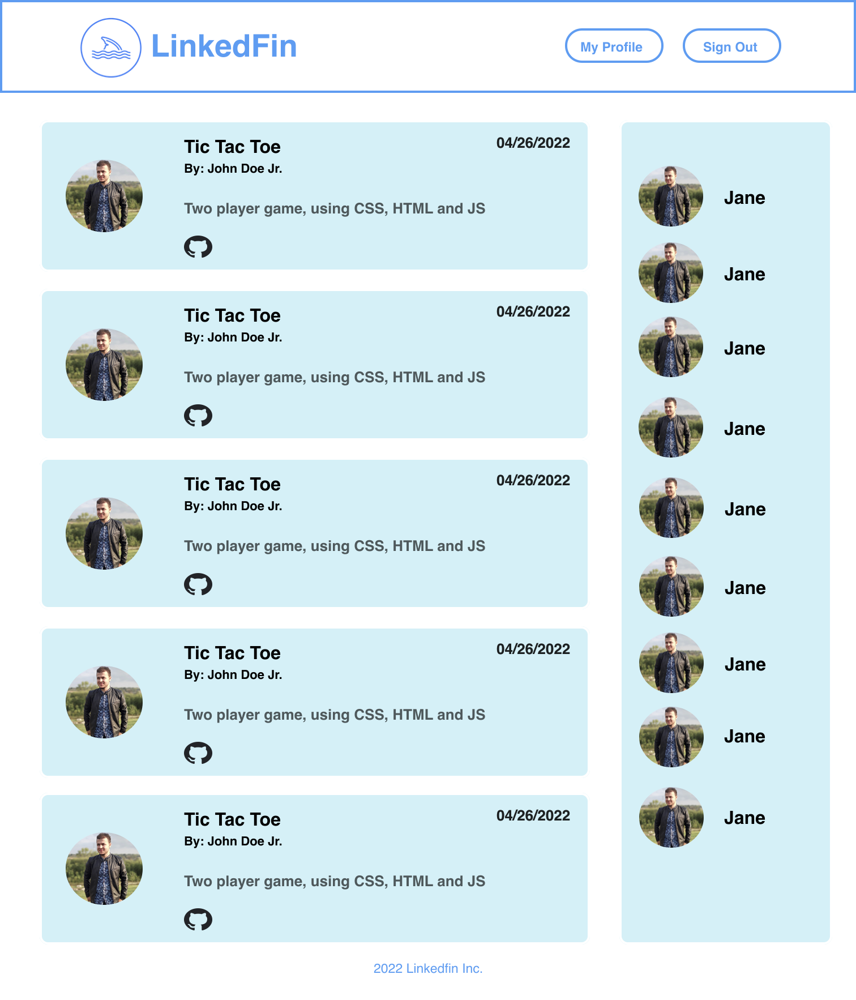
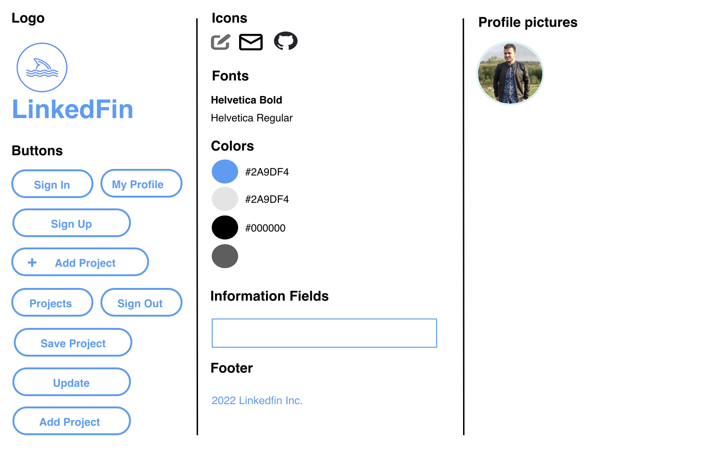

  <h1>LinkedFin 🐬</h1>
  

  <h1>About this project 💻<h1>
  <h3>Hey, there! Welcome to LInkedFin 👋</h3>
  
This project is a shallow copy of the jobs social network, LinkedIn. It was developed by 10 software engineer students.

  <h1>Contributors 🤝</h1>
  <ul align="left">
    <a href="https://github.com/Rodrigowb"><li>Rodrigo Wanderley</li></a>
    <a href="https://github.com/KdoubleUs"><li>Kevin Wu</li></a>
    <a href="https://github.com/Mikey970"><li>Michael Delucia</li></a>
    <a href="https://github.com/ehlee95"><li>Eric Lee</li></a>
    <a href=""><li>Chiu</li></a>
    <a href="https://github.com/Iffat77"><li>Iffat Hossain</li></a>
    <a href="https://github.com/staceycsikos"><li>Stacey Csikos</li></a>
    <a href="https://github.com/Michel9510"><li>Michel Lizardo</li></a>
    <a href=""><li>Brandon Neves</li></a>
    <a href="https://github.com/MannyNR"><li>Emmanuel Nunez</li></a>
    <a href="https://github.com/RaulJiminian"><li>Raul Jiminian</li></a>
  </ul>

  <h2>Technologies ⚙️<h2>
  
   
   
   
   
   
   
   
   
   
   

  <h1>Entity Relationship Diagram 📁</h1>
  

  <h1>UX Design 📃</h1>
  <h2>Interactive Wireframe</h2>
  
  <h2>Stylesheet</h2>  
  
  <h2>Wireframe/stylesheet Screenshots</h2>
  <h3>Landing Page/sign Up</h3>
  
  <h3>Sign In</h3>
  
  <h3>Profile</h3>
  
  <h3>Feed</h3>
  
  <h3>Style Sheet</h3>
  

